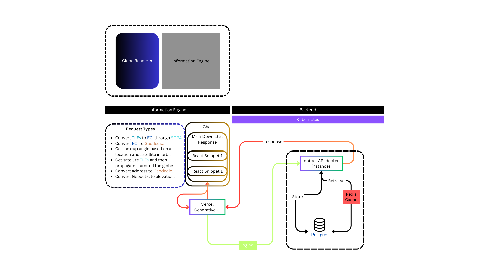

# nanoSatView
*nanoSatView* is an advanced application designed to visualize satellite orbits around the Earth. Leveraging the power of ThreeJS for 3D rendering, NextJS Generative UI for a dynamic and responsive user interface, and a robust .NET backend, Nano SAT VIEW offers a comprehensive solution for satellite orbit visualization.

## Architecture

*nanoSatView* is designed with a robust architecture to visualize satellite orbits around the Earth, leveraging several modern technologies. Below is a detailed explanation of the architecture:

## Components

### 1. Globe Renderer
- **Purpose**: Renders the 3D visualization of satellite orbits.
- **Technology**: Uses ThreeJS for interactive and realistic 3D graphics.

### 2. Information Engine
- **Role**: Acts as the frontend for various types of requests related to satellite data.
- **Functions**:
  - Converts TLEs to ECI using SGP4.
  - Converts ECI to Geodetic coordinates.
  - Determines the look-up angle based on location and satellite in orbit.
  - Fetches satellite TLEs and propagates them around the globe.
  - Converts addresses to Geodetic coordinates.

### 3. Backend
- **Infrastructure**: Runs on Kubernetes to manage containerized applications.
- **Components**:
  - **.NET API Docker Instances**: Handles API requests, processes data, and communicates with the database and cache.
  - **Postgres**: Stores persistent data such as satellite TLEs and user information.
  - **Redis Cache**: Provides caching for quick data retrieval to improve performance.

### 4. Vercel Generative UI
- **Interface**: Provides a modern, intuitive, and responsive user interface built with NextJS.
- **Features**: 
  - Handles user interactions and sends requests to the backend.
  - Displays real-time satellite trajectory visualizations and other relevant data.

## Workflow

1. **User Interaction**:
   - Users interact with the UI components provided by Vercel Generative UI, such as React Snippets for input and chat responses.

2. **Request Processing**:
   - Requests are sent to the Information Engine, which processes various types of satellite data requests.

3. **Backend Communication**:
   - The Information Engine communicates with the backend services, specifically the .NET API Docker instances.
   - These instances retrieve data from the Postgres database and utilize Redis Cache for efficient data handling.

4. **Data Flow**:
   - The backend processes the data and sends the response back to the Information Engine.
   - The Information Engine then propagates the data to the Globe Renderer for visualization and back to the Vercel Generative UI for user interaction.

5. **Rendering and Display**:
   - The Globe Renderer utilizes ThreeJS to render the satellite orbits in 3D.
   - The Vercel Generative UI displays the final visualizations and data, ensuring a seamless user experience.

## Summary

Nano SAT VIEW's architecture integrates powerful backend processing, efficient data handling, and advanced 3D visualization to provide users with an interactive and comprehensive tool for exploring and analyzing satellite orbits.

---

